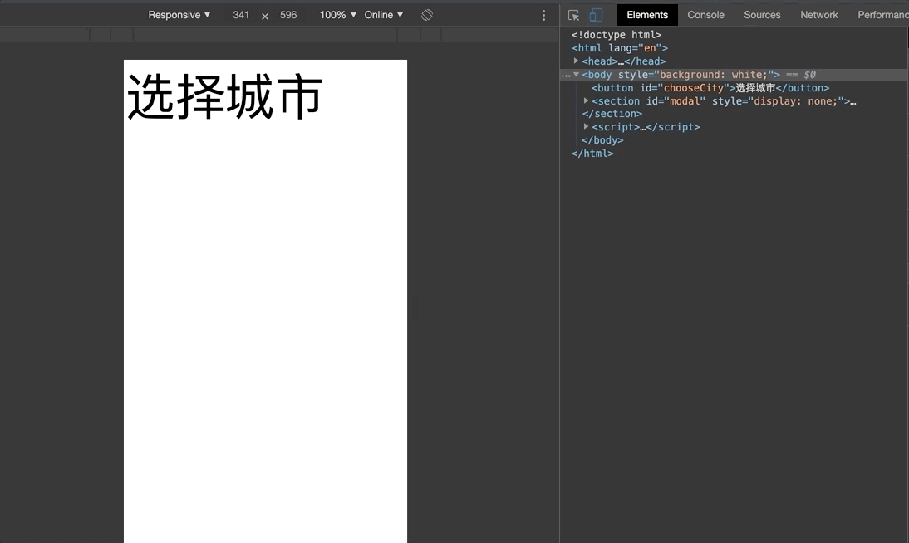

    

# 前言

前几天在做移动端项目遇到了遇到了一个小问题，点击页面上的字段，弹出选择城市的弹层，滚动弹层到底部的时候会引起 body 的滚动。虽然不影响页面功能，但是对于用户体验还是有影响的。

    

[示例地址](./index.html)

# 解决方法

解决这个问题的思路一般来说就是在弹出选择层的时候禁止 body 滚动

## 初次尝试

如何禁止 body 滚动呢，首先想到的是 <code>overflow: hidden<code>

