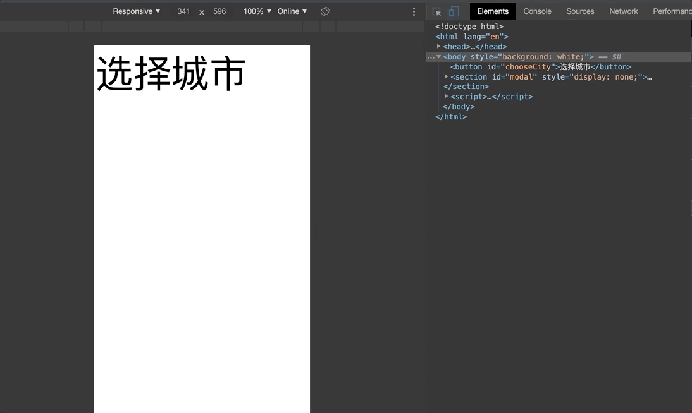

<div align="center">
    
</div>

# 前言

前几天在做移动端项目遇到了遇到了一个小问题，点击页面上的字段，弹出选择城市的弹层，滚动弹层到底部的时候会引起 body 的滚动。虽然不影响页面功能，但是对于用户体验还是有影响的。

<div align="center">
    
</div>

[代码地址](./index.html)


# 解决方法

解决这个问题的思路一般来说就是在弹出选择层的时候禁止 body 滚动

## 初次尝试 （失败）

如何禁止 body 滚动呢，首先想到的是 <code>overflow: hidden;</code>

```js
 // 伪代码

 if (visible) {
    body.style.overflow = 'hidden'
 } else {
    body.style.overflow = 'auto'
 }
```
完美！提测！！！

然后被告知 bug 依然存在。

好吧，这种方法在 PC 端手机模式没问题，但是在<em>安卓</em>真机（华为 nava）上面不行，<em>IOS</em> （xsmax） 可以。


## 再次尝试 （成功）

如果将 html 固定定位呢


```js
 // 伪代码

 if (visible) {
    html.style.position = 'fixed'
 } else {
    html.style.position = 'static'
 }
```

PC 端可以，安卓可以，IOS 可以！

对 body 固定定位同样可以。


## 从事件入手 

页面滚动是浏览器的默认行为，如果禁止了浏览器的默认行为呢？

```js
 // 伪代码

 if (visible) {
    body.addEventListener('touchmove', e => {
        e.preventDefault()
        e.returnValue = false
    }, {passive: false })
 } else {
    // 解绑
 }
```

这种写法会导致整个页面都不能滚动，弹出层的内容也无法滚动，在弹出层的选项很少不需要滚动的情况下是可以采用这种方式的。


