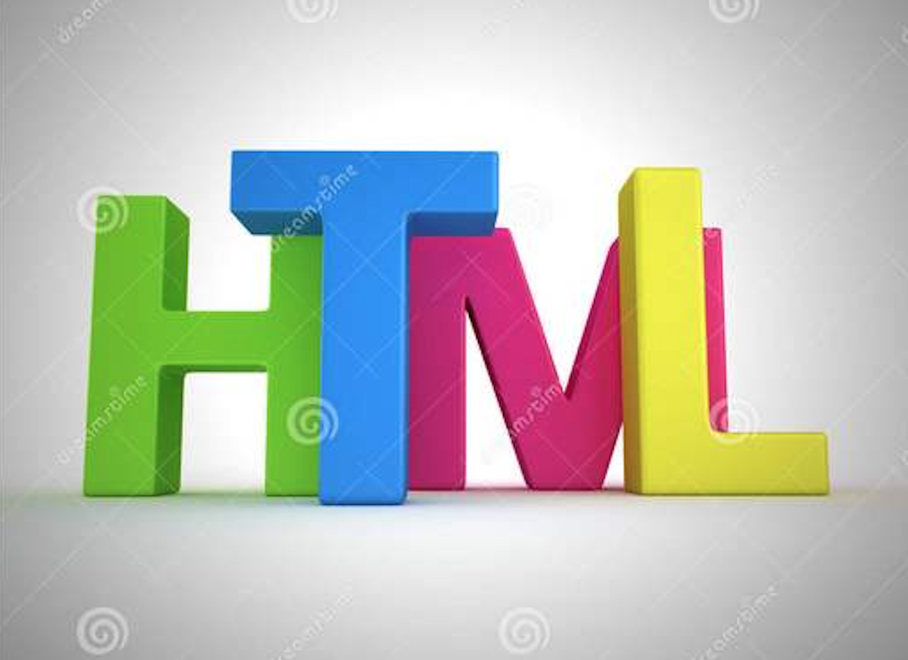

# 前言
在我刚接触前端的时候，html5 标准规范就已经发布了很长时间了。
知道新增了很多功能性标签如 video、audio 等多媒体标签，canvas、svg 图像标签，新的表单类型和属性，以及非常多的语义标签。

然而在的日常开发中除了用一些如 footer、header 等 h5 语义化标签外，其他的基本都是 div + span 一梭子全部搞定。快速还原设计稿，并不会感觉有什么不妥。而且在 HTML 语义上面花费太多时间并不会有一个很明显的收益，还可能会被领导误认为在摸鱼。所以语义化的 HTML 在紧张的开发迭代中就这么被忽略了。

但是作为一条有理想的咸鱼，我觉得还是应该把这一部分知识好好的掌握一下，毕竟还是逼格满满得。

